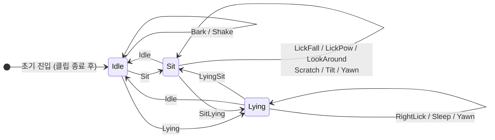

# 가상 펫 행동 시스템 (자율 행동 CVD — 보강안)

> `arFitnessDog.html` 99~119행의 "가상 펫 행동 시스템" 섹션을 대체할 초안입니다.
> 기존 상단 이미지(`fitnessdog1.png`)는 그대로 유지한다는 전제로 작성했습니다.
> 운동 동작을 따라하는 MVD 모드 애니메이션이 아닌, **플레이어 입력과 무관하게 강아지가 스스로 움직이는 CVD(Capricious Virtual Dog) 모드**의 행동 시스템만 다룹니다.
> 구현 근거: `Assets/Scripts/AnimationManager.cs`, `Assets/Scripts/Utils/Define.cs`, `Assets/Scripts/Managers/Managers.cs`

---

자율 행동 모드에서 강아지는 단순 오브젝트가 아니라 살아있는 캐릭터처럼 보여야 합니다. 이를 위해 **계층적 상태 구조(HSM)** + **Animation Event 기반 타이밍 제어** + **ScriptableObject 가중치 테이블** + **쿨다운 페널티** 네 가지를 조합한 자율 행동 시스템을 설계했습니다.

## 1. 계층적 상태 구조 (HSM)

강아지의 행동을 "**기본 자세(base state)**"와 "**그 자세에서 할 수 있는 세부 행동(sub-action)**"의 두 레이어로 분리했습니다. 상태가 바뀔 때마다 가능한 세부 행동 목록이 자동으로 바뀌기 때문에, 서로 어색한 조합(예: 누워서 긁기)이 애초에 만들어지지 않습니다.

이 구조는 업계에서 **계층적 유한 상태 머신(Hierarchical State Machine, HSM)** 이라 부르는 패턴을 따릅니다. 언리얼 엔진의 Behavior Tree + Blackboard, 유니티의 Behavior Graph가 같은 원리로 설계되어 있으며, 상위 상태(base state)가 하위 행동(sub-action)의 선택 범위를 제한하는 것이 핵심입니다.

### 상태와 세부 행동 정의 (Define.cs)

```csharp
public enum DogActionType { Idle, Sit, Lying }

public enum DogIdleAction  { Bark, Shake, Sit, Lying }
public enum DogSitAction   { LickFall, LickPow, LookAround, Scratch, Tilt, Yawn, Idle, SitLying }
public enum DogLyingAction { RightLick, Yawn, Sleep, Idle, LyingSit }
```

- **Idle(서있기)**: 짖기·털기 같은 짧은 제스처, 또는 자세 전환(Sit/Lying)
- **Sit(앉기)**: 핥기·주위 둘러보기·긁기·갸웃거리기·하품 등 풍부한 "앉아서 하는" 잔동작
- **Lying(눕기)**: 발 핥기·자기·하품 중심의 느린 동작

각 enum 항목 중 **`Sit`·`Lying`·`Idle`·`SitLying`·`LyingSit`** 같은 이름은 "세부 행동 + 상태 전이"를 동시에 의미합니다. 그 동작을 재생하면 다음 사이클부터 `curDogState`가 해당 상태로 바뀌어 다음 선택지가 달라집니다.

### 상태 전이 다이어그램



자기 루프(self-loop)로 표시된 동작은 현재 상태를 유지하는 세부 행동이고, 다른 상태로 향하는 화살표는 자세 전환 동작입니다. 한 상태 안에 자기 루프가 **여러 개** 존재하는 덕분에 같은 상태에 오래 머물러도 행동이 반복되지 않습니다.

## 2. Animator 컨트롤러 이원화

강아지는 **운동 판정에 반응하는 MVD 모드**와 **자율 행동을 하는 CVD 모드**에서 서로 다른 애니메이션 집합을 사용합니다. 이를 하나의 Animator Controller로 묶으면 State Machine이 비대해지므로, 두 개의 RuntimeAnimatorController를 두고 모드 진입 시 런타임에 교체하는 방식을 택했습니다.

```csharp
public RuntimeAnimatorController randomAnimator;   // 자율 행동용
public RuntimeAnimatorController fitnessAnimator;  // 운동 판정 반응용

private void Start()
{
    animator.runtimeAnimatorController = fitnessAnimator;
}

public void PlayRandomAnimation()
{
    curDogState = DogActionType.Idle;
    animator.runtimeAnimatorController = randomAnimator;  // 컨트롤러 스왑
    animator.SetTrigger("WakeUp");                        // 깨어나기 진입 클립 재생
    // 이후 흐름은 StateMachineBehaviour.OnStateExit가 이어받음
    // 코루틴·타이머 없이 클립 종료 시점에 ChooseNextAction()이 자동 호출됨
}
```

`WakeUp` 클립에는 `DogActionBehaviour`가 부착되어 있어, 재생이 끝나는 순간 `OnStateExit → ChooseNextAction()`이 호출되면서 자율 루프가 시작됩니다. **코루틴이나 타이머 없이 애니메이션 자체가 루프의 클럭 역할**을 합니다.

이 분리 덕분에 자율 행동 쪽 State Machine 설계를 자유롭게 확장해도 운동 판정 측 애니메이션 전이가 영향을 받지 않습니다.

## 3. Animation Event 기반 타이밍 제어

행동 전환 타이밍은 **고정 시간 간격이 아니라 애니메이션 클립 종료 시점**에 맞춥니다. 기존 코루틴 방식(`yield return new WaitForSeconds(8f)`)은 클립 길이와 무관하게 8초마다 트리거를 날려, 동작이 끝나기 전에 다음 트리거가 겹치거나 동작이 이미 끝났는데 대기 시간이 남아 멍하니 있는 구간이 생길 수 있었습니다.

이를 유니티의 `StateMachineBehaviour`로 교체했습니다. 각 Animator State에 `DogActionBehaviour`를 부착하면, **클립이 실제로 종료되는 순간** `OnStateExit`가 호출되어 다음 행동 선택이 정확히 이어집니다. 코루틴이나 외부 타이머 없이 애니메이션 자체가 루프의 클럭 역할을 합니다.

```csharp
// Animator의 각 State에 부착하는 StateMachineBehaviour
public class DogActionBehaviour : StateMachineBehaviour
{
    public override void OnStateExit(
        Animator animator,
        AnimatorStateInfo stateInfo,
        int layerIndex)
    {
        // 클립이 끝나는 순간 다음 행동 선택을 트리거
        animator.GetComponent<AnimationManager>().ChooseNextAction();
    }
}
```

```csharp
// AnimationManager.cs
public void ChooseNextAction()
{
    switch (curDogState)
    {
        case DogActionType.Idle:  ChooseDogIdleAction();  break;
        case DogActionType.Sit:   ChooseDogSitAction();   break;
        case DogActionType.Lying: ChooseDogLyingAction(); break;
    }
}
```

### 전체 실행 흐름

```
PlayRandomAnimation()
    │
    ├─ runtimeAnimatorController = randomAnimator  // 컨트롤러 스왑
    └─ SetTrigger("WakeUp")                        // 깨어나기 클립 시작
            │
            │  [WakeUp 클립 재생 완료]
            ▼
    DogActionBehaviour.OnStateExit()
            │
            └─ ChooseNextAction()  →  PickAction()  →  SetTrigger(actionName)
                        │
                        │  [행동 클립 재생 완료]
                        ▼
                DogActionBehaviour.OnStateExit()
                        │
                        └─ ChooseNextAction()  →  ...  (반복)
```

- **WakeUp 클립**: 세션 시작 시 강아지가 눈을 뜨고 일어나는 6초짜리 연출 클립. 이 클립에도 `DogActionBehaviour`가 붙어 있어 재생 종료 후 자동으로 첫 번째 행동 선택으로 이어짐
- **클립 종료 기반**: 동작이 끝나기 전에 다음 트리거가 날아가거나, 종료 후 멍하니 대기하는 구간이 원천적으로 발생하지 않음
- **루프 중단**: `StopRandomAnimation()` 호출 시 `DogActionBehaviour`의 `enabled = false`로 루프를 즉시 차단할 수 있음

## 4. ScriptableObject 가중치 테이블

가중치를 코드에 하드코딩하는 대신, **ScriptableObject**로 분리해 에디터에서 바로 수정할 수 있게 했습니다. 이 패턴은 상용 게임에서 기획자와 프로그래머의 역할을 명확히 분리하기 위해 표준적으로 사용됩니다. 가중치를 바꾸기 위해 코드를 열 필요가 없고, 빌드 없이 에디터에서 즉시 결과를 확인할 수 있습니다.

```csharp
// DogBehaviorTable.cs
[CreateAssetMenu(menuName = "Dog/BehaviorTable")]
public class DogBehaviorTable : ScriptableObject
{
    [System.Serializable]
    public struct Entry
    {
        public string actionName;   // enum.ToString()과 동일 철자
        public float  weight;
    }

    public List<Entry> idleActions;
    public List<Entry> sitActions;
    public List<Entry> lyingActions;
}
```

```csharp
// AnimationManager.cs
[SerializeField] private DogBehaviorTable behaviorTable;

private string PickAction(List<DogBehaviorTable.Entry> entries)
{
    float total = entries.Sum(e => e.weight);
    float roll  = UnityEngine.Random.Range(0f, total);
    float acc   = 0f;

    foreach (var e in entries)
    {
        acc += e.weight;
        if (roll < acc) return e.actionName;
    }
    return entries[^1].actionName;
}
```

행동 선택 함수는 모두 `PickAction()`을 거쳐 동작 이름 문자열을 받아옵니다. 새 행동을 추가할 때 코드를 수정하지 않고 ScriptableObject 에셋에서 항목만 추가하면 됩니다.

### Idle 상태 (합 100)

| 행동 | 가중치 | 확률 | 효과 |
| --- | --- | --- | --- |
| Bark | 15 | 15% | 세부 행동 (사운드 포함) |
| Shake | 15 | 15% | 세부 행동 |
| Sit | 35 | 35% | 상태 전이 → Sit |
| Lying | 35 | 35% | 상태 전이 → Lying |

→ **세부 행동 30% vs 자세 전환 70%**. 서 있는 자세는 연출 레퍼토리가 적으므로 자세를 바꿔 다음 사이클에 더 다양한 행동을 쓸 수 있게 유도.

### Sit 상태 (합 140)

| 행동 | 가중치 | 확률 | 효과 |
| --- | --- | --- | --- |
| LickPow | 20 | ≈14.3% | 세부 행동 |
| LickFall | 20 | ≈14.3% | 세부 행동 |
| LookAround | 20 | ≈14.3% | 세부 행동 |
| Scratch | 20 | ≈14.3% | 세부 행동 |
| Tilt | 20 | ≈14.3% | 세부 행동 |
| Yawn | 20 | ≈14.3% | 세부 행동 |
| Idle | 10 | ≈7.1% | 상태 전이 → Idle |
| SitLying | 10 | ≈7.1% | 상태 전이 → Lying |

→ **세부 행동 ≈85.7% vs 자세 전환 ≈14.3%**. 앉기 상태가 연출 자원이 가장 풍부하므로 머무는 시간을 길게 주고, 자세 전환 빈도를 낮춤.

### Lying 상태 (합 110)

| 행동 | 가중치 | 확률 | 효과 |
| --- | --- | --- | --- |
| RightLick | 30 | ≈27.3% | 세부 행동 |
| Sleep | 30 | ≈27.3% | 세부 행동 |
| Yawn | 30 | ≈27.3% | 세부 행동 |
| Idle | 10 | ≈9.1% | 상태 전이 → Idle |
| LyingSit | 10 | ≈9.1% | 상태 전이 → Sit |

→ **세부 행동 ≈81.8% vs 자세 전환 ≈18.2%**. 동작 수는 적지만 확률을 높여 "게으름"이라는 분위기를 유지.

## 5. 쿨다운 페널티

동일한 행동이 연속으로 선택되는 것을 막기 위해 **쿨다운 셋(Cooldown Set)** 을 도입했습니다. 직전에 재생된 행동은 셋에 등록되고, `PickAction()` 진입 전에 해당 항목의 가중치를 0으로 마스킹해 선택 풀에서 제외합니다. 이는 "전체 빈도는 의도대로, 순서는 예측 불가"라는 균형을 유지하면서 "같은 행동 두 번 연속" 어색함을 제거하는 가장 저렴한 방법입니다.

```csharp
private readonly HashSet<string> recentActions = new();

private string PickAction(List<DogBehaviorTable.Entry> entries)
{
    // 쿨다운 중인 항목은 가중치를 0으로 마스킹
    var available = entries
        .Select(e => new DogBehaviorTable.Entry
        {
            actionName = e.actionName,
            weight     = recentActions.Contains(e.actionName) ? 0f : e.weight
        })
        .ToList();

    float total = available.Sum(e => e.weight);

    // 모든 항목이 쿨다운 중이면 쿨다운 해제 후 재시도
    if (total <= 0f)
    {
        recentActions.Clear();
        return PickAction(entries);
    }

    float roll = UnityEngine.Random.Range(0f, total);
    float acc  = 0f;

    foreach (var e in available)
    {
        acc += e.weight;
        if (roll < acc)
        {
            recentActions.Add(e.actionName);
            return e.actionName;
        }
    }
    return available[^1].actionName;
}
```

- 쿨다운 셋에 행동이 쌓이면 점차 다양한 행동을 유도하는 효과가 생김
- 선택 가능한 항목이 전부 소진되면 셋을 초기화해 무한 루프를 방지

## 6. enum과 Animator 트리거 이름 동기화

애니메이션 트리거 문자열을 코드에 하드코딩하지 않고, enum 이름과 Animator 파라미터 이름을 **같은 철자**로 맞춘 뒤 `.ToString()`으로 바로 변환했습니다. `PickAction()`이 반환하는 문자열이 곧 Animator Trigger 이름이 되므로, ScriptableObject의 `actionName` 필드를 enum 항목과 동일 철자로 채우기만 하면 됩니다.

```csharp
string actionName = PickAction(behaviorTable.sitActions);
animator.SetTrigger(actionName);

// 상태 전이가 필요한 경우 actionName으로 판별
if (Enum.TryParse(actionName, out DogActionType nextState))
    curDogState = nextState;
```

- enum에 항목 추가 → Animator에 같은 이름 Trigger 추가 → ScriptableObject에 항목 추가. 세 곳만 동일 철자로 맞추면 즉시 반영
- IDE 자동완성이 enum 경유 시 작동하므로 오타로 인한 무음 실패가 원천적으로 줄어듦
- `DogActionType`·`DogIdleAction`·`DogSitAction`·`DogLyingAction`이 도메인 어휘를 그대로 코드로 들고 오기 때문에 기획 문서와 구현 사이의 번역 부담이 없음

## 7. 상태별 전이 비율 설계의 의도

세 상태의 "세부 행동 vs 자세 전환" 비율을 의도적으로 다르게 두었습니다.

| 상태 | 세부 행동 비율 | 자세 전환 비율 | 의도 |
| --- | --- | --- | --- |
| Idle | 30% | 70% | 서있는 자세의 연출 자원이 적음 → 빠르게 앉히거나 눕혀 다음 사이클에 풍부한 동작 확보 |
| Sit | ≈85.7% | ≈14.3% | 앉기 연출이 가장 다양함 → 이 상태에 오래 머물게 해서 연출 밀도 극대화 |
| Lying | ≈81.8% | ≈18.2% | 동작 수는 적지만 확률을 높여 "게으름"이라는 분위기 유지 |

결과적으로 관찰자 입장에서 강아지는 "가끔 서서 짖고, 앉아서 이것저것 하다가, 가끔 드러누워 자는" 리듬을 갖게 됩니다. 단일 균등 분포(1/N씩 균등 랜덤)로 구현했을 때보다 훨씬 자연스러운 생활 패턴이 만들어졌습니다.

## 8. 연출 레이어 — 사운드 동기화

`Bark` 액션만 예외적으로 애니메이션 트리거와 사운드 재생을 **같은 프레임에** 발동시킵니다.

```csharp
if (actionName == DogIdleAction.Bark.ToString())
{
    animator.SetTrigger(actionName);
    audioSource.PlayOneShot(audioClip);   // 짖기 사운드 동기화
}
else
{
    animator.SetTrigger(actionName);
}
```

- `Animation Event`를 사용하지 않고 코드 측에서 직접 사운드를 쏘는 이유는, **가중치 분기 코드가 곧 연출 결정 코드**가 되도록 한 곳에 모으기 위함
- 이후 다른 동작(Scratch/Shake 등)에 사운드를 추가하더라도 ScriptableObject에 사운드 클립 필드를 추가하고, `PickAction()` 반환 직후 한 줄씩만 더하면 됨

## 9. 운동 모드(MVD)와 자율 모드(CVD) 전환

자율 행동 시스템은 세션 시작 시 `Managers.StartVideo()`에서 `PlayCondition`에 따라 조건부로 활성화됩니다.

```csharp
public void StartVideo()
{
    videoPlayer.Play();

    switch (playCondition)
    {
        case PlayCondition.Condition1:        // NVD
            FitnessDogInteractable(false);    // 강아지 자체를 숨김
            break;
        case PlayCondition.Condition2:        // CVD
            FitnessDogInteractable(true);
            animationManager.PlayRandomAnimation();   // 자율 행동 시작
            break;
        case PlayCondition.Condition3:        // MVD
            FitnessDogInteractable(true);
            BodyJointController.videoStart = true;    // 운동 판정 시작
            break;
    }
}
```

- **NVD**: 강아지 오브젝트를 비활성화 → 애니메이션 자체가 필요 없음
- **CVD**: `PlayRandomAnimation()` 진입 → Animator를 `randomAnimator`로 교체하고, Idle 진입 클립 재생 → `StateMachineBehaviour.OnStateExit`에서 자율 루프 시작
- **MVD**: 자율 루프를 쓰지 않고, 초기값인 `fitnessAnimator`를 유지한 채 `BodyJointController`의 판정이 직접 Animator Trigger를 제어

즉 같은 강아지 오브젝트 위에 "자율 행동 컨트롤러"와 "운동 반응 컨트롤러"가 **상호 배타적**으로 걸리는 구조입니다. 두 모드의 코드가 서로를 방해하지 않도록 진입 경로 자체를 나눈 것이 핵심이었습니다.

## 10. 설계 회고

**왜 StateMachineBehaviour인가?**
코루틴 고정 주기 방식은 클립 길이와 독립적으로 돌아가기 때문에 타이밍 오차가 생깁니다. `StateMachineBehaviour.OnStateExit`는 Animator가 State를 빠져나가는 정확한 프레임에 호출되므로, 별도 타이머 없이 클립 종료 시점과 행동 선택 시점이 자동으로 일치합니다. 루프 중단도 `enabled = false` 한 줄로 처리할 수 있어 코루틴 관리보다 간결합니다.

**왜 HSM 구조인가?**
"자세별로 가능한 동작 목록이 다르다"는 제약을 코드 레벨이 아닌 구조 레벨에 박아두고 싶었습니다. 하나의 거대한 확률 테이블로 모든 동작을 섞어 뽑으면 "누워서 긁기" 같은 어색한 조합을 피하려고 매번 조건문을 걸어야 합니다. 상위 상태 → 세부 행동 순서로 분기하면 그 제약이 구조 안에 자연스럽게 내재화됩니다.

**왜 가중치 확률 방식인가?**
결정론적 시퀀스로 정교하게 짜면 개별 장면은 더 깔끔해지지만, 같은 시점에 앉아 있다가 특정 순서로만 움직이기 때문에 관찰자가 패턴을 학습해버립니다. 가중치 확률은 "전체 빈도는 의도대로, 순서는 예측 불가"라는 균형을 주는 가장 저렴한 방법이었습니다.

**왜 ScriptableObject인가?**
가중치는 밸런싱 과정에서 반복적으로 조정됩니다. 코드에 하드코딩되어 있으면 매번 재컴파일이 필요하지만, ScriptableObject로 분리하면 에디터에서 실시간으로 수치를 바꾸며 결과를 확인할 수 있습니다. 코드와 데이터의 책임을 분리하는 것은 상용 게임 개발에서 기획-개발 협업의 기본 원칙입니다.

**남은 확장 방향**
현재 쿨다운 셋은 직전 행동 하나만 제외하는 단순 방식입니다. 더 자연스러운 다음 단계는 최근 N회 재생 이력을 큐로 관리하는 **슬라이딩 윈도우 쿨다운**, 혹은 시간대별로 ScriptableObject 가중치 테이블 자체를 교체하는 **일주기성(Circadian) 테이블 스왑**입니다.

---

## 한 줄 요약

> 강아지의 행동을 **HSM(상위 자세 / 하위 세부 행동)** 으로 분리하고, **StateMachineBehaviour의 OnStateExit**로 클립 종료 시점에 정확히 다음 행동을 선택하며, **ScriptableObject 가중치 테이블**로 기획 데이터와 코드를 분리했다. **쿨다운 셋**으로 동일 행동 연속 재생을 차단하고, enum 이름과 Animator Trigger 이름을 동일 철자로 맞춰 하드코딩을 없앴으며, 모드별 Animator 컨트롤러를 교체해 자율 행동과 운동 반응을 상호 배타적으로 분리했다.