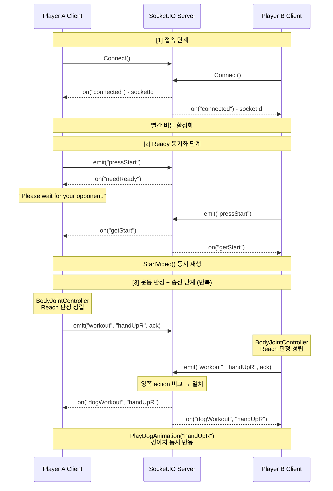

# 멀티플레이 세션 동기화 (네트워킹 보강안)

> `arFitnessDog.html` 138~146행의 "멀티플레이 세션 동기화" 섹션을 대체할 초안입니다.
> 기존 상단 이미지(`fitnessdog_server.png`)는 그대로 유지한다는 전제로 작성했습니다.
> 구현 근거: `Assets/Scripts/NetworkManager.cs`, `Assets/Scripts/AnimationManager.cs`, `Assets/Scripts/Managers/Managers.cs`, `Assets/Scripts/BodyJointController.cs`

## ⚠ 포트폴리오 표기 불일치 안내 (HTML 반영 시 확인 필요)

- 현재 `arFitnessDog.html`은 **사용 기술 태그**와 **멀티플레이 세션 동기화 섹션 문구**에서 `Photon 2` / "Photon을 활용해 두 클라이언트를 연결..." 으로 기재되어 있습니다.
- 실제 리포지토리 구현은 **Socket.IO (Firesplash.UnityAssets.SocketIO)** 기반입니다. `NetworkManager.cs`는 `SocketIOCommunicator`로 통신하며, 이벤트도 `On(...)` / `Emit(...)` 기반입니다.
- 이 초안은 **실제 코드 기준**으로 작성했습니다. HTML에 옮기실 때 `skill-type`의 `Photon 2` 태그와 본 섹션 첫 문장을 Socket.IO 기준으로 함께 수정하시는 걸 추천드립니다.

---

AR Fitness Dog의 2인 멀티플레이는 단순히 "두 클라이언트를 연결"하는 것이 아니라, **판정은 각 클라이언트가 수행하고 반응 발생 권한은 서버가 가진** 구조를 설계했습니다. 각 플레이어의 HMD가 자기 몸동작을 판정해 액션 키 문자열을 서버로 쏘고, 서버가 양쪽 액션을 비교한 뒤 일치할 때만 양 클라이언트에 "반응하라"는 방송을 내려보내는 방식입니다.

## 1. 기술 스택 및 역할 분리

- **프로토콜**: Socket.IO (Unity 측 `Firesplash.UnityAssets.SocketIO` 에셋)
- **클라이언트**: Meta Quest 3 위의 Unity 클라이언트 2대. 각자 IOBT로 판정하고 액션 키를 송신
- **서버**: 외부 Socket.IO 서버. Ready 상태와 액션 상태를 집계하고, 협동 조건 성립 시 반응 이벤트를 양쪽에 방송
- **권한 모델**:
  - 판정 권한 → **각 클라이언트** (자기 몸은 자기가 인식)
  - 반응 트리거 권한 → **서버** (언제 강아지가 반응할지 결정)
  - 이 분리 덕에 두 HMD 사이의 프레임 오차나 판정 타이밍 차이가 있어도, 실제로 강아지가 반응하는 시점은 서버 이벤트 수신 시점으로 동기화됨

## 2. 이벤트 토폴로지

Socket.IO 위에서 사용한 이벤트는 총 7개입니다. 모두 `NetworkManager.StartNetwork()`에서 등록/발행됩니다.

### 클라이언트가 수신하는 이벤트 (On)


| 이벤트명         | 의미                      | 클라이언트 동작                                        |
| ------------ | ----------------------- | ----------------------------------------------- |
| `connected`  | 서버 연결 성립 + Socket ID 확인 | 디버그 텍스트에 Socket ID 표시, 빨간 버튼 활성화                |
| `needReady`  | 내 쪽은 준비됐지만 상대가 아직 안 됨   | "Please wait for your opponent." 표시, 버튼 비활성     |
| `getStart`   | 양쪽 모두 준비 완료, 세션 시작      | 텍스트 초기화, 버튼 비활성, `StartVideo()` 호출              |
| `dogWorkout` | 양쪽 동작이 일치해 강아지가 반응해야 함  | `AnimationManager.PlayDogAnimation(payload)` 호출 |
| `disconnect` | 연결 종료                   | 디버그 로그 출력                                       |


### 클라이언트가 송신하는 이벤트 (Emit)


| 이벤트명         | 트리거 시점             | 페이로드                |
| ------------ | ------------------ | ------------------- |
| `pressStart` | 플레이어가 준비 버튼을 눌렀을 때 | 없음 (단순 신호)          |
| `workout`    | 판정이 성립한 순간(상승 엣지)  | 액션 키 문자열 + ack=true |


수신 페이로드는 `ServerTechData { string ready; string action; }` 형태의 JSON 문자열로 내려오며, `JsonUtility.FromJson<ServerTechData>(payload)`로 역직렬화합니다.

## 3. 세션 생명주기 시퀀스

접속부터 협동 반응까지의 흐름을 한 다이어그램으로 보면 다음과 같습니다.




구간별 의미:

1. **접속 단계**: 두 클라이언트 모두 `Connect()`를 호출하면 서버가 각자에게 `connected`를 돌려주고, 이 순간 UI상 빨간 버튼(준비 버튼)이 눌러질 수 있는 상태가 됩니다.
2. **Ready 동기화**: 한쪽만 준비 버튼을 눌렀을 때 서버는 그 클라이언트에게 `needReady`를 돌려 "대기 중" UI로 전환시킵니다. 두 번째 플레이어가 준비를 마치면 서버는 양쪽에 `getStart`를 **동시에** 방송해 영상 재생 타이밍을 맞춥니다.
3. **운동 루프**: 각 클라이언트의 `BodyJointController`는 로컬 판정을 수행해 상승 엣지가 발생할 때마다 `workout` 이벤트에 액션 키를 실어 보냅니다. 서버가 두 플레이어의 액션이 일치한다고 판단하면 `dogWorkout`으로 반응을 방송합니다.

## 4. 이벤트 핸들러 등록 구조

모든 핸들러는 `StartNetwork()` 안에서 등록된 후 마지막에 `Connect()`를 호출합니다. "등록이 끝난 뒤 소켓을 연다"는 순서를 고정해 첫 `connected` 이벤트를 놓치지 않도록 했습니다.

```csharp
public void StartNetwork()
{
    sioCom = GetComponent<SocketIOCommunicator>();

    sioCom.Instance.On("connected", (payload) =>
    {
        ServerTechData srv = JsonUtility.FromJson<ServerTechData>(payload);
        mainManager.SetDebugText("Connected! Socket ID: " + sioCom.Instance.SocketID);
        mainManager.RedButtonInteractable(true);
    });

    sioCom.Instance.On("getStart", (payload) =>
    {
        mainManager.SetDebugText("");
        mainManager.SetScreenText("");
        mainManager.RedButtonInteractable(false);
        mainManager.StartVideo();
    });

    sioCom.Instance.On("dogWorkout", (payload) =>
    {
        animationManager.PlayDogAnimation(payload);
    });

    // ... needReady / disconnect ...

    sioCom.Instance.Connect();
}
```

네트워크 이벤트 핸들러는 UI 갱신과 게임 상태 변경을 `**Managers`와 `AnimationManager`로 위임**하는 얇은 어댑터 역할만 수행합니다. 네트워크 계층이 게임 로직을 직접 건드리지 않도록 분리해, 싱글 모드 코드와 멀티 모드 코드가 동일한 진입점(`StartVideo`, `PlayDogAnimation`)을 공유할 수 있습니다.

## 5. Ready / Start 동기화 메커니즘

두 HMD에서 영상 시작 시점이 어긋나면 이후 `videoTime` 기반 Step 분기(Reach/Squat/Punch/Stretch)까지 어긋나 판정이 정상 동작하지 않습니다. 이를 방지하기 위해 **시작 타이밍 결정 권한을 클라이언트가 아닌 서버에 둔** 것이 핵심입니다.

- 플레이어가 준비 버튼을 누르면 `SendReady()` → `emit("pressStart")`
- 서버는 두 클라이언트의 `ready` 상태가 모두 충족되었는지 확인
- 한쪽만 준비됨 → 그 클라이언트에 `needReady` 응답 → "Please wait for your opponent." 표시
- 양쪽 모두 준비됨 → 양 클라이언트에 `getStart` 방송 → 동시에 `StartVideo()` 실행

```csharp
public void SendReady()
{
    sioCom.Instance.Emit("pressStart");
}
```

클라이언트는 자신의 "준비 완료"를 주장할 뿐이고, "영상 틀어도 된다"는 판단은 전적으로 서버가 내립니다. 덕분에 두 플레이어의 버튼 누른 시각이 몇 초 떨어져 있어도 영상 시작 시점은 서버 방송 도달 시점으로 맞춰집니다.

## 6. 운동 액션 전송과 협동 판정

운동 중 판정이 성립한 순간 각 클라이언트는 액션 키 문자열만 서버로 보냅니다.

```csharp
public void SendActionState(string action)
{
    // 세 번째 인자 true: ack 요구 → 서버 도착 확인
    sioCom.Instance.Emit("workout", action, true);
}
```

- 송신 페이로드는 `"handUpR"`, `"handUpL"`, `"handUpA"`, `"sitDown"`, `"sitUp"`, `"punchR"`, `"punchL"`, `"strechR"`, `"strechL"` 중 하나의 **액션 키 문자열 하나**로 단순화되어 있음
- 서버는 두 플레이어의 최근 액션을 비교 → **같은 키가 들어왔을 때만** 양쪽에 `dogWorkout`으로 그 키를 되쏴줌
- 수신 측의 분기점은 `AnimationManager.PlayDogAnimation(payload)` 한 곳. 액션 키에 따라 `handup`/`sit`/`stand` 같은 Animator 파라미터를 직접 제어

```csharp
sioCom.Instance.On("dogWorkout", (payload) =>
{
    animationManager.PlayDogAnimation(payload);
});
```

결과적으로 **싱글 모드의 로컬 판정 경로**와 **멀티 모드의 서버 중재 경로**가 완전히 동일한 `PlayDogAnimation(actionKey)` 진입점을 사용합니다. 판정 로직이나 애니메이션 트리거 코드가 한 곳에만 존재하므로, 이후 동작을 추가할 때 싱글/멀티 양쪽이 자동으로 확장됩니다.

## 7. 싱글 / 멀티 모드 분기 — 네트워크 건너뛰기 구조

네트워크는 멀티 모드일 때만 초기화됩니다. 싱글 모드는 소켓 연결 자체를 하지 않아 오프라인 플레이가 가능합니다.

```csharp
public void PressStartButton()
{
    // ...
    startMenu.SetActive(false);

    if (playerMode == PlayerMode.OnePlayer)
        RedButtonInteractable(true);          // 네트워크 연결 스킵
    else if (playerMode == PlayerMode.TwoPlayer)
        networkManager.StartNetwork();        // 소켓 연결 시작
}
```

`PressReadyButton()`도 동일 패턴입니다. OnePlayer는 곧바로 `StartVideo()`를 호출하고, TwoPlayer는 `networkManager.SendReady()`만 호출해 서버의 `getStart` 응답을 기다립니다. 이처럼 **진입/대기만 모드별로 갈라지고 이후 게임 루프는 공유**되도록 설계한 것이 코드 중복을 피한 포인트였습니다.

## 8. UI / UX와 네트워크 상태 연결

네트워크 이벤트는 단 **두 개의 UI 채널**로만 투영됩니다. 이렇게 채널을 좁혀두면 어떤 이벤트가 와도 플레이어가 보는 화면 변화가 예측 가능해집니다.


| 네트워크 상태        | UI 채널 A: 빨간 버튼 | UI 채널 B: 스크린 텍스트                 |
| -------------- | -------------- | -------------------------------- |
| 연결 전           | 비활성            | (비어 있음)                          |
| `connected` 수신 | **활성**         | Socket ID 디버그 표시                 |
| `needReady` 수신 | 비활성            | "Please wait for your opponent." |
| `getStart` 수신  | 비활성            | 초기화 (비움)                         |


## 9. 데이터 계약과 직렬화

- 서버 → 클라이언트 페이로드는 `ServerTechData` 구조체로 역직렬화:
  ```csharp
  struct ServerTechData
  {
      public string ready;
      public string action;
  }
  ```
- 클라이언트 → 서버 페이로드는 **액션 키 문자열 한 개**로 경량화
- 프로젝트에는 확장용 구조체 `SendActionData { int player; string name; bool value; bool action; }`가 정의되어 있으나, 현재 `NetworkManager`는 문자열 기반 프로토콜을 채택해 직렬화 비용과 서버 스키마 복잡도를 줄였습니다
- 대신 동작 강도·타이밍 등 추가 정보를 실어야 할 때는 이 구조체로 전환하는 확장 경로를 남겨둔 셈

## 10. 설계 회고

**왜 P2P가 아닌 서버 중재(broadcast) 구조인가?**
두 HMD 사이에서 동작 일치 여부를 P2P로 판정하려면 어느 쪽이 기준 클록인가를 정해야 하고, 그 결정이 양쪽 UI와 애니메이션 트리거에 모두 반영되어야 합니다. 서버에 "양쪽 액션을 비교해 반응을 방송한다"는 단일 권한을 두면 클라이언트는 판정 결과만 송신하면 되고, 반응 타이밍은 서버 방송 도달 시점으로 강제로 맞춰집니다. 덕분에 프레임 오차·네트워크 지터가 있어도 두 화면의 강아지는 같은 순간에 반응합니다.

**남은 한계**
서버 의존도가 높아 서버 다운 시 멀티 플레이는 즉시 불가능합니다. 또 프로토콜이 액션 키 문자열 단일값이라, 추후 동작 강도·정확도·연속성 같은 지표를 함께 전송하려면 `SendActionData` 수준의 구조화된 페이로드와 서버 측 스키마 관리가 필요합니다. 이는 이후 버전에서 확장하기 좋은 자연스러운 방향입니다.

---

## 한 줄 요약

> 각 클라이언트는 자기 몸을 판정해 **액션 키만** 서버로 쏘고, 서버는 **두 액션이 일치할 때만** 양쪽에 반응을 방송한다. 결과적으로 "협동이 성립해야 강아지가 반응한다"는 게임 루프가 네트워크 계층 자체에서 자연스럽게 구현된다.

