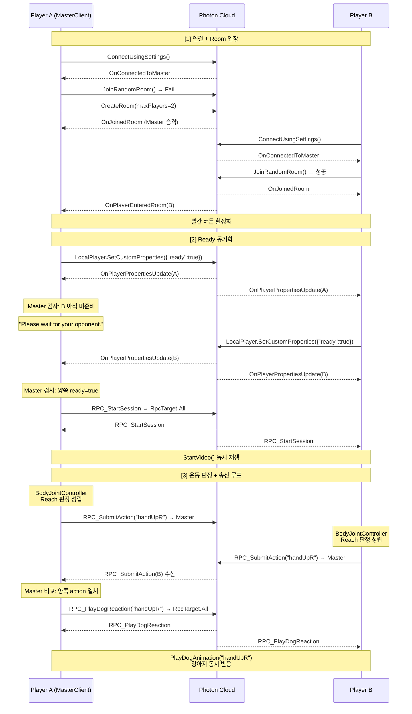

# 멀티플레이 세션 동기화 — Photon PUN2 버전 (네트워킹 보강안)

> `arFitnessDog.html` 138~146행의 "멀티플레이 세션 동기화" 섹션을 대체할 초안입니다. 기존 상단 이미지(`fitnessdog_server.png`)는 그대로 유지한다는 전제로 작성했습니다.
> 이 문서는 포트폴리오 기재에 맞춰 **Photon PUN2 기반**으로 네트워크 계층을 구성한다고 가정하고, 같은 설계 의도(판정=클라이언트 / 반응 결정=권한 클라이언트)를 PUN2의 Room·RPC·MasterClient 개념으로 풀어냈습니다.
> 참고 구현(도메인 로직·모드 분기): `Assets/Scripts/NetworkManager.cs`, `Assets/Scripts/AnimationManager.cs`, `Assets/Scripts/Managers/Managers.cs`, `Assets/Scripts/BodyJointController.cs`

---

AR Fitness Dog의 2인 멀티플레이는 "두 플레이어의 동작이 모두 성립해야 강아지가 반응한다"는 협동 조건을 네트워크 계층에서 그대로 구현합니다. Photon PUN2에서는 별도 서버를 두는 대신 **MasterClient**(방장 역할의 클라이언트)가 권한을 가지고 두 플레이어의 상태를 비교한 뒤, `RpcTarget.All` 방송으로 모든 클라이언트의 강아지를 같은 순간에 반응하게 만듭니다.

## 1. 기술 스택 및 역할 분리

- **프로토콜**: Photon PUN2 (Photon Unity Networking 2) — Photon Cloud 릴레이 기반
- **클라이언트**: Meta Quest 3 위의 Unity 클라이언트 2대. 각자 IOBT로 판정하고 액션을 RPC로 송신
- **MasterClient**: 먼저 방에 입장한 클라이언트가 자동 승격. "반응 브로드캐스트 권한"을 행사
- **권한 모델**
  - 판정 권한 → **각 클라이언트** (자기 몸은 자기가 인식)
  - 반응 트리거 권한 → **MasterClient** (두 액션이 일치했을 때만 전체 방송)
  - 렌더링 권한 → **모든 클라이언트** (RPC 방송을 받으면 로컬 Animator로 동시에 연출)

> MasterClient가 끊기면 Photon이 자동으로 다른 참가자에게 권한을 이양(`OnMasterClientSwitched`)하므로, "한 플레이어가 나가도 세션이 죽지 않는" 복구 경로가 기본 제공됩니다.

## 2. RPC/콜백 토폴로지

Socket.IO의 문자열 이벤트 이름 대신, PUN2에서는 **콜백 메서드**와 **RPC 메서드**가 같은 역할을 맡습니다.

### Photon이 호출하는 콜백 (수신 측)


| 콜백                         | 트리거 시점         | 클라이언트 동작                       |
| -------------------------- | -------------- | ------------------------------ |
| `OnConnectedToMaster`      | 로비 서버 접속 성공    | `JoinRandomRoom()` 호출          |
| `OnJoinRandomFailed`       | 참가할 방이 없을 때    | `CreateRoom(maxPlayers: 2)` 호출 |
| `OnJoinedRoom`             | 방 입장 완료        | 빨간 버튼 활성화                      |
| `OnPlayerEnteredRoom`      | 상대 플레이어 입장     | 대기 안내 문구 해제                    |
| `OnPlayerPropertiesUpdate` | Ready 상태 변경 감지 | MasterClient가 두 Ready를 비교      |
| `OnDisconnected`           | 연결 종료          | 디버그 로그 + UI 복구                 |


### 직접 정의한 RPC 메서드


| RPC                                  | 호출 방향                  | 페이로드 | 의미                |
| ------------------------------------ | ---------------------- | ---- | ----------------- |
| `RPC_SubmitAction(string action)`    | 각 클라이언트 → MasterClient | 액션 키 | 판정 결과 송신          |
| `RPC_StartSession()`                 | MasterClient → All     | 없음   | 영상 동시 재생 트리거      |
| `RPC_PlayDogReaction(string action)` | MasterClient → All     | 액션 키 | 협동 일치 시 강아지 반응 방송 |


Ready 상태는 별도 RPC 대신 `PhotonNetwork.LocalPlayer.SetCustomProperties({"ready": true})`를 통해 플레이어 속성으로 올리고, MasterClient는 `OnPlayerPropertiesUpdate` 콜백에서 두 플레이어의 `ready` 값이 모두 true인지 확인합니다. "일시적 상태는 Custom Property, 순간 이벤트는 RPC"로 역할을 나눈 구조입니다.

## 3. 세션 생명주기 시퀀스

접속부터 협동 반응까지의 흐름을 한 다이어그램으로 보면 다음과 같습니다.




구간별 의미:

1. **연결 + Room 입장**: `ConnectUsingSettings()`로 Photon 로비 접속 → `JoinRandomRoom()` 시도 → 실패 시 `CreateRoom(maxPlayers=2)`. 먼저 들어간 쪽이 자동으로 MasterClient가 되고, 두 번째 플레이어 입장 순간 양쪽 UI가 활성화됩니다.
2. **Ready 동기화**: Ready 상태는 플레이어 Custom Property로 공유됩니다. MasterClient가 `OnPlayerPropertiesUpdate`에서 두 플레이어의 `ready`가 모두 true인지 확인한 뒤 `RPC_StartSession`을 `RpcTarget.All`로 호출해 두 HMD의 영상 시작 시점을 맞춥니다.
3. **운동 루프**: 각 클라이언트는 판정 성립 순간 `RPC_SubmitAction`을 `RpcTarget.MasterClient`로 보냅니다. MasterClient는 두 플레이어의 최근 액션을 비교해 일치할 때만 `RPC_PlayDogReaction`을 `RpcTarget.All`로 방송합니다.

## 4. 콜백/RPC 등록 구조

네트워크 진입점인 `NetworkManager`는 `MonoBehaviourPunCallbacks`를 상속해 PUN 콜백을 override 합니다. 별도 등록 API를 호출하지 않아도 상속만으로 콜백이 자동 연결되므로, "등록 누락" 실수 자체가 발생하지 않는 구조입니다.

```csharp
using Photon.Pun;
using Photon.Realtime;
using ExitGames.Client.Photon;

public class NetworkManager : MonoBehaviourPunCallbacks
{
    Managers mainManager;
    AnimationManager animationManager;

    public void StartNetwork()
    {
        mainManager = GetComponent<Managers>();
        animationManager = GetComponent<AnimationManager>();

        PhotonNetwork.AutomaticallySyncScene = true;
        PhotonNetwork.ConnectUsingSettings();
    }

    public override void OnConnectedToMaster()
    {
        mainManager.SetDebugText("Connected to Photon Master");
        PhotonNetwork.JoinRandomRoom();
    }

    public override void OnJoinRandomFailed(short returnCode, string message)
    {
        PhotonNetwork.CreateRoom(null, new RoomOptions { MaxPlayers = 2 });
    }

    public override void OnJoinedRoom()
    {
        mainManager.SetDebugText("Joined Room. Waiting for opponent...");
        mainManager.RedButtonInteractable(PhotonNetwork.CurrentRoom.PlayerCount == 2);
    }

    public override void OnPlayerEnteredRoom(Player newPlayer)
    {
        mainManager.SetDebugText("");
        mainManager.RedButtonInteractable(true);
    }
}
```

네트워크 콜백은 UI/게임 상태 갱신을 `Managers` · `AnimationManager`에 위임하는 **얇은 어댑터** 역할만 맡습니다. 네트워크 계층이 도메인 로직에 직접 개입하지 않도록 분리해, 싱글 모드와 멀티 모드가 동일한 진입점(`StartVideo`, `PlayDogAnimation`)을 공유할 수 있습니다.

## 5. Ready / Start 동기화 메커니즘

두 HMD에서 영상 시작 시점이 어긋나면 이후 `videoTime` 기반 Step 분기(Reach/Squat/Punch/Stretch)까지 어긋나 판정이 정상 동작하지 않습니다. 이를 방지하기 위해 **시작 타이밍 결정 권한을 개별 클라이언트가 아니라 MasterClient에 둔 것**이 핵심입니다.

- 플레이어가 준비 버튼을 누르면 `SendReady()` → 자기 Custom Property에 `{ "ready": true }` 세팅
- 해당 변경은 모든 클라이언트에 `OnPlayerPropertiesUpdate` 콜백으로 전달됨
- MasterClient는 그 콜백에서 두 플레이어의 `ready`를 모두 확인
- 모두 true면 `RPC_StartSession`을 `RpcTarget.All`로 호출 → 두 클라이언트가 같은 프레임에 `StartVideo()` 실행

```csharp
public void SendReady()
{
    var props = new Hashtable { { "ready", true } };
    PhotonNetwork.LocalPlayer.SetCustomProperties(props);
}

public override void OnPlayerPropertiesUpdate(Player target, Hashtable changed)
{
    if (!PhotonNetwork.IsMasterClient) return;
    if (!changed.ContainsKey("ready")) return;

    bool allReady = true;
    foreach (var p in PhotonNetwork.PlayerList)
    {
        if (!p.CustomProperties.TryGetValue("ready", out var v) || !(bool)v)
        {
            allReady = false;
            break;
        }
    }

    if (allReady)
        photonView.RPC(nameof(RPC_StartSession), RpcTarget.All);
    else if (target == PhotonNetwork.LocalPlayer)
        mainManager.SetScreenText("Please wait for your opponent.");
}

[PunRPC]
void RPC_StartSession()
{
    mainManager.SetDebugText("");
    mainManager.SetScreenText("");
    mainManager.RedButtonInteractable(false);
    mainManager.StartVideo();
}
```

클라이언트는 자신의 "준비 완료"를 주장할 뿐이고, "영상 틀어도 된다"는 판단은 전적으로 MasterClient가 내립니다. 덕분에 두 플레이어의 버튼 누른 시각이 몇 초 떨어져 있어도, 영상 시작 시점은 RPC 방송 도달 시점으로 맞춰집니다.

## 6. 운동 액션 전송과 협동 판정

운동 중 판정이 성립한 순간 각 클라이언트는 액션 키 문자열만 MasterClient로 RPC를 통해 보냅니다.

```csharp
public void SendActionState(string action)
{
    // 나 자신의 판정을 MasterClient에게만 알림
    photonView.RPC(nameof(RPC_SubmitAction),
                   RpcTarget.MasterClient,
                   action,
                   PhotonNetwork.LocalPlayer.ActorNumber);
}

// 최근 액션 2개(플레이어 번호 기준)를 보관
Dictionary<int, string> lastAction = new Dictionary<int, string>();

[PunRPC]
void RPC_SubmitAction(string action, int actorNumber)
{
    if (!PhotonNetwork.IsMasterClient) return;

    lastAction[actorNumber] = action;

    // 두 플레이어가 같은 액션을 보냈는지 검사
    if (lastAction.Count == 2 &&
        lastAction.Values.Distinct().Count() == 1)
    {
        photonView.RPC(nameof(RPC_PlayDogReaction),
                       RpcTarget.All,
                       action);
        lastAction.Clear();
    }
}

[PunRPC]
void RPC_PlayDogReaction(string action)
{
    animationManager.PlayDogAnimation(action);
}
```

- 송신 페이로드는 `"handUpR"`, `"handUpL"`, `"handUpA"`, `"sitDown"`, `"sitUp"`, `"punchR"`, `"punchL"`, `"strechR"`, `"strechL"` 중 하나의 **액션 키 문자열 하나**로 단순화
- MasterClient는 두 플레이어의 최근 액션을 사전(dictionary)에 보관하다가 **같은 키가 들어왔을 때만** `RPC_PlayDogReaction`을 `RpcTarget.All`로 방송
- 수신 측의 분기점은 `AnimationManager.PlayDogAnimation(payload)` 한 곳. 액션 키에 따라 `handup`/`sit`/`stand` 같은 Animator 파라미터를 직접 제어

결과적으로 **싱글 모드의 로컬 판정 경로**와 **멀티 모드의 RPC 중재 경로**가 완전히 동일한 `PlayDogAnimation(actionKey)` 진입점을 사용합니다. 판정 로직이나 애니메이션 트리거 코드가 한 곳에만 존재하므로, 이후 동작을 추가할 때 싱글/멀티 양쪽이 자동으로 확장됩니다.

## 7. 싱글 / 멀티 모드 분기 — 네트워크 건너뛰기 구조

네트워크는 멀티 모드일 때만 초기화됩니다. 싱글 모드는 Photon 로비 접속 자체를 하지 않아 오프라인 플레이가 가능합니다.

```csharp
public void PressStartButton()
{
    // ...
    startMenu.SetActive(false);

    if (playerMode == PlayerMode.OnePlayer)
        RedButtonInteractable(true);          // Photon 접속 스킵
    else if (playerMode == PlayerMode.TwoPlayer)
        networkManager.StartNetwork();        // ConnectUsingSettings()
}
```

`PressReadyButton()`도 동일 패턴입니다. OnePlayer는 곧바로 `StartVideo()`를 호출하고, TwoPlayer는 `networkManager.SendReady()`만 호출해 MasterClient의 `RPC_StartSession` 방송을 기다립니다. 이처럼 **진입/대기만 모드별로 갈라지고 이후 게임 루프는 공유**되도록 설계한 것이 코드 중복을 피한 포인트였습니다.

## 8. UI / UX와 네트워크 상태 연결

네트워크 이벤트는 단 **두 개의 UI 채널**로만 투영됩니다. 채널을 좁혀두면 어떤 이벤트가 와도 플레이어가 보는 화면 변화가 예측 가능해집니다.


| 네트워크 상태               | UI 채널 A: 빨간 버튼 | UI 채널 B: 스크린 텍스트                 |
| --------------------- | -------------- | -------------------------------- |
| 연결 전                  | 비활성            | (비어 있음)                          |
| `OnConnectedToMaster` | 비활성            | "Connected to Photon Master"     |
| `OnJoinedRoom` (1인)   | 비활성            | "Waiting for opponent..."        |
| `OnPlayerEnteredRoom` | **활성**         | (초기화)                            |
| 한쪽만 Ready             | 비활성            | "Please wait for your opponent." |
| `RPC_StartSession`    | 비활성            | (초기화, 영상 재생)                     |


## 9. 데이터 계약과 직렬화

- 플레이어 상태(Ready 등)는 **Custom Properties**(`Hashtable`)로 공유 — 지속/동기화가 필요한 상태에 적합
- 순간 이벤트(운동 판정, 세션 시작)는 **RPC 인자**로 전송 — 단발성 신호에 적합
- RPC 인자는 PUN2 기본 직렬화 타입(`string`, `int`, `bool`, 배열 등)으로 충분하므로, 현재 액션 키 단일 `string`으로 경량화
- 확장 여지: 프로젝트에 정의된 구조체 `SendActionData { int player; string name; bool value; bool action; }`로 전환하고 `PhotonPeer.RegisterType`을 통해 커스텀 직렬화를 등록하면, 동작 강도·타이밍 등 추가 지표를 함께 전송 가능

## 10. 설계 회고

**왜 전용 서버가 아닌 MasterClient 중재 구조인가?**
2인 전용 세션 규모에서는 별도 게임 서버를 운용하는 비용보다 MasterClient가 심판 역할을 맡는 방식의 운영 비용이 훨씬 낮습니다. PUN2의 Photon Cloud는 릴레이만 제공하고 판정 로직은 MasterClient 안에서 실행되기 때문에, "누가 반응을 트리거할지"를 한 클라이언트에 명시적으로 모아두면 두 화면의 강아지가 **같은 RPC 방송 시점에** 반응합니다. 프레임 오차·네트워크 지터가 있어도 반응 순간의 정렬은 Photon이 보장합니다.

**남은 한계**
MasterClient에 로직이 몰려 있어 해당 클라이언트의 성능·네트워크 품질이 세션 전체를 좌우합니다. 다만 PUN2가 `OnMasterClientSwitched` 콜백과 자동 권한 이양을 지원하므로, 한쪽이 끊겨도 세션을 이어가는 복구 경로를 수월하게 붙일 수 있습니다. 또 프로토콜이 액션 키 문자열 단일값이라, 추후 동작 강도·정확도·연속성 같은 지표를 함께 전송하려면 `SendActionData` 수준의 구조화된 RPC 인자와 버전 관리가 필요합니다. 이는 이후 버전에서 확장하기 좋은 자연스러운 방향입니다.

---

## 한 줄 요약

> 각 클라이언트는 자기 몸을 판정해 **액션 키만** MasterClient로 RPC 송신하고, MasterClient는 **두 액션이 일치할 때만** `RpcTarget.All`로 반응을 방송한다. 결과적으로 "협동이 성립해야 강아지가 반응한다"는 게임 루프가 Photon RPC 계층 자체에서 자연스럽게 구현된다.

