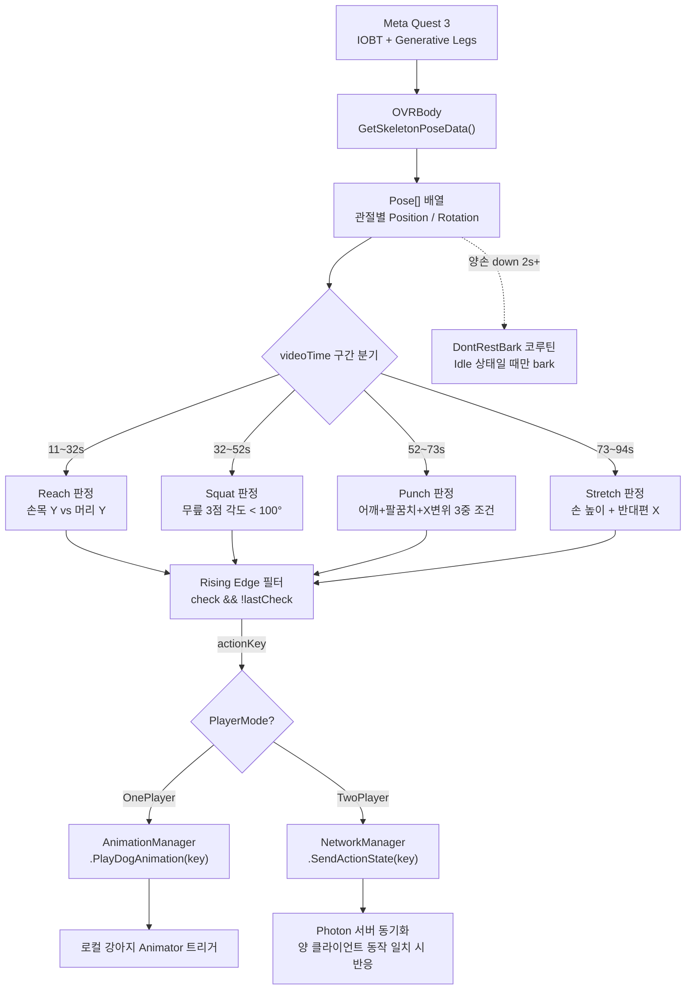

# 실시간 동작 판정과 반응형 애니메이션 (보강안)

> `arFitnessDog.html` 121~136행의 같은 제목 섹션을 대체할 초안입니다.
> 기존 상단 이미지(`fitnessdog_ivd.png`)와 Reach/Squat/Punch/Stretch GIF 4분할 그리드는 그대로 유지한다는 전제로 작성했습니다.
> 구현 근거: `Assets/Scripts/BodyJointController.cs`

---

반응형 펫 모드(MVD)에서 "플레이어의 운동이 곧바로 강아지 반응으로 이어지는" 피드백 루프를 만들기 위해, 입력 → 판정 → 트리거 → 반응 경로까지 한 스크립트(`BodyJointController.cs`) 안에서 엮었습니다. 아래는 그 단계별 설계입니다.

## 전체 파이프라인




## 1. 입력 데이터 파이프라인

Meta Quest 3의 **IOBT(Inside-Out Body Tracking)** 와 **Generative Legs** 데이터를 Meta XR SDK의 `OVRBody` 컴포넌트로 받아 매 프레임 전신 Pose 배열을 구성했습니다.

- `OVRSkeleton.IOVRSkeletonDataProvider`를 통해 `SkeletonPoseData`를 획득
- `BoneTranslations`(Vector3f) / `BoneRotations`(Quatf)를 Unity 좌표계로 변환(`FromFlippedZVector3f`)해 `Pose[]`로 정규화
- 전체 관절 중 판정에 사용한 인덱스를 고정해 해석을 단순화


| 부위                | 인덱스          |
| ----------------- | ------------ |
| 머리                | 7            |
| 골반                | 1            |
| 왼쪽 어깨 / 팔꿈치 / 손목  | 8 / 11 / 19  |
| 오른쪽 어깨 / 팔꿈치 / 손목 | 13 / 16 / 45 |
| 손 들기 판정용 상단점(좌/우) | 33 / 59      |
| 왼쪽 엉덩이 / 무릎 / 발목  | 77 / 78 / 79 |
| 오른쪽 엉덩이 / 무릎 / 발목 | 70 / 71 / 72 |


```csharp
public static Pose[] GetSkeletonJointPoses(OVRBody ovrBody)
{
    OVRSkeleton.IOVRSkeletonDataProvider dataProvider = ovrBody;
    OVRSkeleton.SkeletonPoseData poseData = dataProvider.GetSkeletonPoseData();
    OVRPlugin.Vector3f[] positions = poseData.BoneTranslations;
    OVRPlugin.Quatf[]    rotations = poseData.BoneRotations;

    Pose[] jointPoses = new Pose[rotations.Length];
    for (int i = 0; i < rotations.Length; i++)
    {
        jointPoses[i] = new Pose(
            positions[i].FromFlippedZVector3f(),
            rotations[i].FromFlippedZQuatf()
        );
    }
    return jointPoses;
}
```

## 2. 공통 판정 유틸 — 3점 벡터 내각

팔꿈치·무릎처럼 "얼마나 굽혔는가"를 알아야 하는 동작을 위해 세 관절 위치로부터 가운데 관절의 굴곡각을 계산하는 유틸을 만들었습니다.

```csharp
float GetJointAngle(Vector3 x, Vector3 y, Vector3 z)
{
    // y를 꼭짓점으로 하는 두 벡터(y→x, y→z) 사이의 각도
    Vector3 vectorYX = x - y;
    Vector3 vectorYZ = z - y;
    return Vector3.Angle(vectorYX, vectorYZ);
}
```

- 무릎 각도 = `GetJointAngle(엉덩이, 무릎, 발목)`
- 팔꿈치 각도 = `GetJointAngle(손목, 팔꿈치, 어깨)`
- 어깨 각도 = `GetJointAngle(손목, 어깨, 골반)`

이 하나의 함수로 모든 관절 각도 판정을 통일해, 동작을 추가할 때 새 수학 로직 없이 조합만으로 확장 가능하도록 했습니다.

## 3. 4개 동작별 판정 로직

### 3-1. Reach (팔 뻗기)

가장 단순한 판정. 머리(7)보다 손목 보조 포인트(좌 33 / 우 59)의 Y 좌표가 높으면 팔이 올라간 것으로 간주합니다. 좌/우를 독립적으로 계산해 "한쪽만 든 상태"까지 구분합니다.

```csharp
bool CheckLeftHandUp(Pose[] jointPoses)
{
    // jointPoses[7]: 머리, jointPoses[33]: 왼손 상단점
    return jointPoses[7].position.y < jointPoses[33].position.y;
}
```

### 3-2. Squat

양쪽 무릎 각도를 **동시에** 확인해, 두 쪽 모두 `100°` 미만으로 굽혀졌을 때 "앉음" 상태로 판정합니다. `lastSit` 플래그로 "앉기"와 "다시 일어나기"를 두 개의 별개 이벤트(`sitDown` / `sitUp`)로 나눠 강아지가 **앉을 때**와 **일어설 때** 각각 다른 애니메이션을 재생하도록 했습니다.

```csharp
float squatThreshold = 100f;

if (leftLegAngle < squatThreshold && rightLegAngle < squatThreshold && !lastSit)
{
    // 앉는 순간 → sitDown
    TriggerAction("sitDown");
    lastSit = true;
}
else if (leftLegAngle > squatThreshold && rightLegAngle > squatThreshold && lastSit)
{
    // 일어나는 순간 → sitUp
    TriggerAction("sitUp");
    lastSit = false;
}
```

### 3-3. Punch

단일 조건만으로는 팔 들기 / 스트레칭 등과 구분이 어려워 **3중 조건 AND**로 구성했습니다.

1. **어깨 각도** `70° ~ 110°` — 팔이 대략 수평일 것
2. **팔꿈치 각도** `> 85°` — 팔이 접혀있지 않고 펴져있을 것
3. **손목 X 변위** `|Δx| > 0.15m` — 몸통 바깥쪽으로 실제 뻗은 거리

```csharp
bool CheckPunchLeft(Pose[] jointPoses)
{
    float shoulder = GetJointAngle(jointPoses[19].position,
                                   jointPoses[8].position,
                                   jointPoses[1].position);
    float arm      = GetJointAngle(jointPoses[19].position,
                                   jointPoses[11].position,
                                   jointPoses[8].position);
    Vector3 dir    = jointPoses[19].position - jointPoses[11].position;

    if (70f < shoulder && shoulder < 110f && arm > 85f)
    {
        if (dir.x > 0.15f) return true;
    }
    return false;
}
```

"각도로 포즈를 묶고, 위치 변위로 동작 성립을 확인"하는 구조라, 느린 이동·정적인 자세 유지 같은 상황이 펀치로 오인식되는 것을 막았습니다.

### 3-4. Stretch

옆구리 스트레칭(팔을 머리 너머 반대편으로 넘기는 자세)을 근사하기 위해 두 조건을 결합했습니다.

- 손 Y > 머리 Y (팔이 머리 위로 올라갔는가)
- 손 X가 머리 X의 **반대 방향**으로 넘어갔는가 (몸 반대쪽으로 기울였는가)

각도 계산 없이도 스트레칭의 시각적 특징을 충분히 포착할 수 있어 판정 비용을 낮췄습니다.

## 4. 상승 엣지 트리거로 중복/노이즈 제거

판정 함수들은 매 프레임 `true`/`false`를 반환하기 때문에, 조건이 성립한 상태가 지속되는 동안 애니메이션 트리거가 수십 번 연속 발생할 수 있습니다. 이를 막기 위해 모든 동작에 **상승 엣지(rising edge)** 패턴을 적용했습니다.

```csharp
checkLeft = !rightHandUp && leftHandUp;

if (checkLeft && !lastCheckLeft)   // 이번 프레임에만 true가 된 경우
{
    TriggerAction("handUpR");      // 한 동작에 한 번만 반응
    result = true;
}
lastCheckLeft = checkLeft;
```

이 구조 덕분에:

- 한 동작당 **한 번만** 반응이 발생 → 애니메이션 덮어쓰기 방지
- 트래킹 값이 임계치 근처에서 떨릴 때 생기는 연쇄 트리거도 차단
- 판정 로직 자체는 "현재 상태가 맞는가"만 보게 단순화

## 5. 타임라인 기반 시퀀스 전환

`videoTime`(세션 시작 이후 누적 시간)을 기준으로 운동 구간을 명시적으로 분리했습니다. 구간 밖에서는 해당 동작의 판정 함수 자체를 호출하지 않기 때문에, 예컨대 스쿼트 구간에서 팔을 올리더라도 Reach 이벤트가 발생하지 않습니다.


| videoTime | Step   | 내용                     |
| --------- | ------ | ---------------------- |
| 0 ~ 11s   | Step 0 | 시작 연출, 강아지 등장 + 첫 bark |
| 11 ~ 32s  | Step 1 | Reach (좌/우 번갈아 팔 들기)   |
| 32 ~ 52s  | Step 3 | Squat (앉기 / 일어나기)      |
| 52 ~ 73s  | Step 4 | Punch (좌/우)            |
| 73 ~ 94s  | Step 5 | Stretch                |
| 94s ~     | Finish | 모든 애니메이터 파라미터 리셋       |


"지금 어떤 운동을 해야 하는가"가 영상 타임라인에 의해 고정돼 있고, 그 외 구간에서는 의도적으로 판정을 끄는 방식이라 **오탐으로 인한 펫 반응 엇박자**를 원천적으로 줄일 수 있었습니다.

## 6. 비활동 감지 루프 (Bark Feedback)

운동 구간(11s ~ 94s) 동안 "이번 프레임에 판정 이벤트가 발생했는가?"를 `working` 플래그로 집계합니다. `working == false` 이고 양손이 모두 내려가 있을 때만 무동작 타이머를 누적해, 2초 이상 지속되면 강아지가 재촉하듯 짖게 만들었습니다.

```csharp
if (11f <= videoTime && videoTime < 94f)
{
    if (!working)
        CheckHandDownTime(!rightHandUp && !leftHandUp);
    else
    {
        checkHandDwnTimer = 0f;
        animator.ResetTrigger("bark");
    }
}
```

`DontRestBark` 코루틴은 발동 직전에 **현재 애니메이션 클립**을 조회해 Idle 루프(`078_Idle_Loop`)일 때만 bark를 트리거합니다.

```csharp
AnimatorClipInfo[] clips = animator.GetCurrentAnimatorClipInfo(0);
if (clips.Length > 0 && clips[0].clip.name.Equals("078_Idle_Loop"))
{
    animator.SetTrigger("bark");
    audioSource.PlayOneShot(audioClip);
}
```

앉기/일어서기 전환 같은 연출 중에 bark가 끼어들어 어색해지는 경우를 실제 플레이테스트에서 발견한 뒤 추가한 가드라, "캐릭터 현재 상태와 충돌하지 않을 때만 개입한다"는 규칙으로 정리했습니다.

## 7. 판정 → 반응 경로 분기

판정이 성립한 순간 **같은 `actionKey` 문자열**을 가지고 `PlayerMode`에 따라 갈라집니다. 싱글과 멀티가 동일한 판정 코드를 공유하고 하단 전송 경로만 다르기 때문에, 이후 판정 로직을 고쳐도 양쪽 모드에 동시에 반영됩니다.

```csharp
if (playerMode == PlayerMode.OnePlayer)
    animationManager.PlayDogAnimation("sitDown");   // 로컬 Animator 트리거
else if (playerMode == PlayerMode.TwoPlayer)
    networkManager.SendActionState("sitDown");      // Photon 서버로 전송
```

- **OnePlayer**: 판정 즉시 로컬 강아지 Animator가 반응 → 개인 플레이의 즉각적인 피드백 확보
- **TwoPlayer**: 서버로 액션 상태를 보내고, 상대 플레이어의 액션과 일치할 때만 반응을 확정 → "협동해야 강아지가 반응한다"는 게임 루프 성립

## 요약

XR 트래킹 데이터(OVRBody) → 프레임별 조건 판정(좌표 비교 + 3점 각도 + 상대 변위) → 상승 엣지 필터 → 타임라인 기반 구간 분리 → 상태 메모리(lastSit / lastCheck*) → 로컬/네트워크 경로 분기로 이어지는 실시간 입력 루프를 한 스크립트로 완성했습니다. 단순 좌표 비교에서 한 단계 더 들어가 **여러 조건을 조합하고, 시간 창·상태 메모리까지 얹은 덕분에** 트래킹 노이즈 환경에서도 플레이어 행동이 즉시 펫 반응으로 이어지는 안정적인 피드백 루프를 확보할 수 있었습니다.